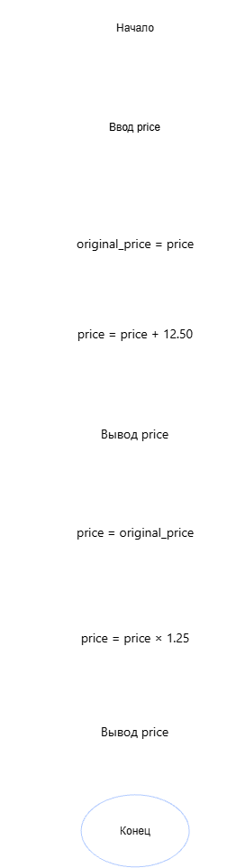

# Домашнее задание к работе 2

## Условие задачи

Переменная `double price` хранит цену товара. Напишите оператор (инструкцию),
который увеличивает цену:

**(a)** на **$12.50**  
**(b)** на **25%**

---

## 1. Алгоритм и блок-схема

### Алгоритм

1. Объявить переменную `price` типа `double`.
2. Запросить у пользователя исходную цену товара (`price`).
3. Увеличить цену на фиксированную сумму: `price = price + 12.50`.
4. Вывести значение цены после увеличения на $12.50.
5. Снова присвоить `price` исходное значение.
6. Увеличить цену на 25%: `price = price * 1.25`.
7. Вывести значение цены после увеличения на 25%.
8. Завершить программу.

### Блок-схема



---

## 2. Реализация программы
---

## 3. Результаты работы программы

Пример работы программы при вводе цены **100**:

```
Введите цену товара: 100

(а) Цена после увеличения на $12.50: 112.50
(b) Цена после увеличения на 25%: 125.00
```

Пояснение:
- `price = price + 12.50;` — оператор увеличения цены на фиксированную сумму.
- `price = price * 1.25;` — оператор увеличения цены на 25%
  (100% + 25% = 125%, т.е. множитель `1.25`).

---

## 4. Информация о разработчике

- **ФИО:** Аносов Сергей Юрьевич
- **Группа:** бОТИ-261
